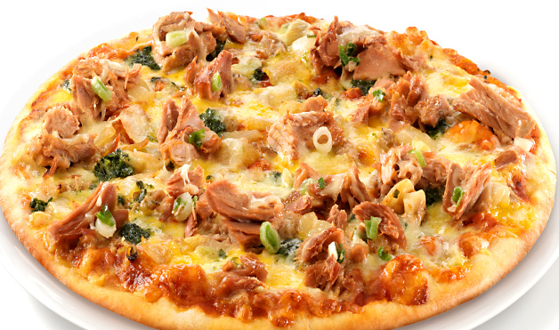

<!--

WARNING!! DON'T EDIT THE FILE README.md on the root of the project, that one is a GENERATED FILE!

You should just edit the source file at src/README.md - the one which stars with ## Writing your own DSL using Ruby

-->

## Writing your own DSL using Ruby


Ricardo Nacif @ [Avenue Code](http://www.avenuecode.com)

*rjunior@avenuecode.com*

Sep 25th, 2014

---

## Agenda

 - DSL - What and Why
  - External DSL Examples
  - Internal DSL Examples
 - Ruby Overview
  - Struct vs Class
  - Blocks, Procs and Lambdas
  - How Self Works
  - class_eval
  - instance_eval
  - method_missing


----

 - Implementing a DSL 
 - Conclusion
 - Learning More
 - Challenge

---


## Prerequisites

- Basic Ruby

---

## DSL - What and Why

 - DSL stands for *Domain Specific Language*
 - It's a programming language focused on a *particular domain* or *task*. It removes extra code for a particular task and allow you to get things done in a more direct way
 - It increases *readability* for other people
 - Two types of DSL: External and Internal

---

## External DSL Examples

 ##### GHERKIN (CUCUMBER)

```gherkin
Feature: Serve coffee
    Coffee should not be served until paid for
    Coffee should not be served until the button has been pressed
    If there is no coffee left then money should be refunded

  Scenario: Buy last coffee
    Given there are 1 coffees left in the machine
    And I have deposited 1$
    When I press the coffee button
    Then I should be served a coffee

```


----

## External DSL Examples

 ##### CSS

```

html,
body {
  width: 100%;
  height: 100%;
  overflow: hidden;
}


```

---

## Internal DSL Examples

 ##### Rspec

```ruby
# these two expectations...
expect(alphabet).to start_with("a")
expect(alphabet).to end_with("z")

# ...can be combined into one expression:
expect(alphabet).to start_with("a").and end_with("z")

# You can also use `or`:
expect(stoplight.color).to eq("red").or eq("green").or eq("yellow")

```

----


## Internal DSL Examples

 ##### Factory Girl

```ruby
FactoryGirl.define do
  factory :user do
    first_name "John"
    last_name  "Doe"
    admin false
  end

  factory :admin, class: User do
    first_name "Admin"
    last_name  "User"
    admin true
  end
end


```

----


## Internal DSL Examples

 ##### Capybara

```ruby
within("#session") do
  fill_in 'Email', :with => 'user@example.com'
  fill_in 'Password', :with => 'password'
end
click_button 'Sign in'


```

----


## Internal DSL Examples

 ##### Rails Routes

```ruby
Rails.application.routes.draw do

  match 'photos', to: 'photos#show', via: [:get, :post]

end
```

---

## Struct VS Class

 - These two bellow define the *same thing*


```ruby
class User
  attr_accessor :name, :age

  def initialize name, age
    @name = name
    @age = age
  end

end

```

```
User = Struct.new(:name, :age)

```


---

## Blocks and Procs
 ##### Understanding do/end

```ruby
[1, 2, 3].each { |n| puts n }

#=> 1
#=> 2
#=> 3
# Same thing

[1, 2, 3].each do |n| 
  puts n 
end

#=> 1
#=> 2
#=> 3

```

----


## Blocks and Procs
 ##### Understanding blocks

```ruby
def do_this_twice
  yield
  yield
end

```

```ruby
do_this_twice { puts "Hey guys!" }
#=> "Hey guys!"
#=> "Hey guys!"

```

----

## Blocks and Procs
 ##### Understanding blocks

```ruby
def do_this_if_block
  if block_given?
    yield
  else
    puts 'no block was given'
  end
end

```


----


## Blocks and Procs
 ##### Understanding blocks

```ruby
def do_something_in_between
  puts 'Whatever code that is here, is going to be executed first' 
  yield
  puts 'And this after'
end

```

```ruby
do_something_in_between { puts "This is what I passed in a block to the method" }
#=> "Whatever code that is here, is going to be executed first"
#=> "This is what I passed in a block to the method"
#=> "And this after"

```

----


## Blocks and Procs
 ##### Understanding blocks

```ruby
class User 
    def initialize( name ) 
         @name = name
    end

    def do_this_with_name 
        yield( @name ) 
    end
end

person = User.new("Oscar")
person.do_this_with_name do |name|
  puts "Hey, his name is #{name}"
end


```

----

## Blocks and Procs
 ##### Understanding Procs

```ruby
square = Proc.new do |n|
  n ** 2
end

square = lambda do |n|
  n ** 2
end


square.call(2)


```

----

## Blocks and Procs
 ##### Converting Procs to Blocks

```ruby
square = Proc.new do |n|
  n ** 2
end

[1, 2].each(square) #won't work
[1, 2].each(&square) #will convert the proc to a block


```

----

## Blocks and Procs
 ##### Converting Procs to Blocks

```ruby
class Alphabet

  def self.each_letter(&block) #here it converts the block into a proc
    ('A'..'Z').each(&block) #here it converts the proc back again to a block
  end

end

Alphabet.each_letter { |l| puts l }


```

---

## How *Selfie* Works


---


## How *Self* Works

 - The keyword self in Ruby gives you access to the *current object*

```ruby
class User

  attr_accessor :name

  def puts_self
    puts self
  end

  def self.puts_self
    puts self
  end

end

user = User.new
user.puts_self
User.puts_self
```


---

## class_eval

 - Method that evaluate arbitrary code in the context of a particular *class*

```ruby
class User
  
  attr_accessor :name, :age

end

```

```
User.class_eval do 
  
  attr_accessor :email

end


```

```ruby
user = User.new
user.email = 'john@gmail.com'

puts user.email
#=> john@gmail.com
```


---

## instance_eval

 - Method that evaluate arbitrary code in the context of an *object*


```ruby
class User
  
  attr_accessor :name, :age

end

user = User.new

user.instance_eval do
  self.name = 'My new name'
end

user.name
#=> My new name

```

----
## instance_eval

 - You can also pass a block to it, and self will be referring to the object


```ruby
class User  
  attr_accessor :name, :age
end

user = User.new

my_block = Proc.new { self.age = 12}

my_block.call

#=> undefined method `age=' for main:Object

user.instance_eval &my_block

user.age
#=> 12

```

---


## method_missing

 - This special method is called whenever Ruby *can't find* a method with that name

```ruby
class User
  
  attr_accessor :name, :age

  def method_missing(method_name, *args)
    puts "You tried to call the method #{method_name} with those arguments #{args}"
  end

end

```

----

## method_missing

 - It's used to delegate methods to an *associated object*


```ruby
Address = Struct.new(:street, :zip_code)

class User
  attr_accessor :name, :age, :address

  def method_missing method_name, *args
    address.send(method_name, *args)
  end
end

address = Address.new("123 Street", '90303')

user = User.new

user.address = address

user.street

```
 

---

## Implementing a DSL

 - Enough talking! Let's make our own DSL, a Pizza Menu *:D*


----
## Implementing a DSL
 
 #### This is the API we want to create a new pizza

```ruby

create_pizza "Mussarela" do
  add_vegetable 'tomatoes'
  add_sauce 'barbecue'
  add_cheese 'cheddar'
  add_topping 'chicken'
  set_price 32.33
end


```

----
## Implementing a DSL
 
 #### Our first implementation

```ruby
Pizza = Struct.new(:vegetable, :sauce, :cheese, :sauce, :topping, :price)
@pizza = Pizza.new

def add_vegetable name
  @pizza.vegetable = name
end

def add_sauce name
  @pizza.sauce = name
end
 # ... (other methods to add cheese and topping) 
def set_price name
  @pizza.price = name
end

def create_pizza name
  @pizza = Pizza.new
  yield if block_given?
end

```

----

## Implementing a DSL
 
 #### Nice, but there are two problems

 - We're *polluting* the *global namespace*
 - Rule number #1 when it comes to pizza: The *more* toppings, the *better*.




----

## Implementing a DSL

 #### Our new API

```ruby

Menu.add_pizza "Mussarela" do
  add_vegetable 'tomatoes'
  add_sauce 'barbecue'
  add_cheese 'cheddar'
  add_toppings 'chicken', 'peperoni', 'Bacon', 'Eggs'
  set_price 32.33
end

```

----
## Implementing a DSL

 ####pizza.rb

```ruby
class Pizza
  attr_accessor :name, :vegetable, :sauce, :cheese, :sauce, :toppings, :price

  def initialize name
    @name = name
  end

  def add_vegetable name
    @vegetable = name
  end

  def add_sauce name
    @sauce = name
  end

  def add_cheese name
    @cheese = name
  end

  def add_toppings *args
    raise "Too many toppings man!" if args.size > 4
    @toppings = args
  end

  def set_price name
    @price = name
  end
end

```


----

## Implementing a DSL

 ####menu.rb

```ruby
class Menu
  @@pizzas = []

  def self.add_pizza name, &block
    pizza = Pizza.new(name)
    pizza.instance_eval(&block) if block_given?
    @@pizzas << pizza
  end


  def self.pizzas
    @@pizzas
  end

end


```

----

## Implementing a DSL

 ####pizza.rb

 - Hey, it's not DRY!

```ruby

class Pizza
 
  ...
   
  def add_vegetable name
    @vegetable = name
  end

  def add_sauce name
    @sauce = name
  end

  def add_cheese name
    @cheese = name
  end

  ...
end

```


----

## Implementing a DSL

 ####refactoring pizza.rb

```ruby

class Pizza
  attr_accessor :name, :vegetable, :sauce, :cheese, :sauce, :toppings, :price

  def initialize name
    @name = name
  end

  def add_toppings *args
    @toppings = args
  end

...

private
  def method_missing method_name, *args
    method_name = method_name.to_s.split('add_')[1]
    self.send(method_name + "=", args[0])
  end

end

```

----


## Implementing a DSL

 #### Improving our DSL

```ruby

Menu.add_pizza('Peperoni').add_vegetable('tomatoes').add_sauce('curry').add_toppings('bacon', 'cucumber').set_price(30)

```

----

## Implementing a DSL

  - In order to achieve method chaining, simply *return self* on all the instance methods

```ruby

class Pizza
  attr_accessor :name, :vegetable, :sauce, :cheese, :sauce, :toppings, :price
  ...
  def add_toppings *args
    @toppings = args
    self
  end

  def set_price name
    @price = name
    self
  end

  private

  def method_missing method_name, *args
    method_name = method_name.to_s.split('add_')[1]
    self.send(method_name + "=", args[0])
    self
  end

end

```

----

## Implementing a DSL

  - Also, *return* the pizza object when creating it

```ruby

class Menu
  @@pizzas = []

  def self.add_pizza name, &block
    pizza = Pizza.new(name)
    pizza.instance_eval(&block) if block_given?
    @@pizzas << pizza
    pizza
  end


  def self.pizzas
    @@pizzas
  end

end


```

----

## Implementing a DSL

 #### Adding observations to a pizza

```ruby
Menu.add_pizza "Mussarela" do
  add_vegetable 'tomatoes'
  add_sauce 'barbecue'
  add_cheese 'cheddar'
  add_toppings 'chicken', 'peperoni'
  set_price 32.33
  
  doesnt_contain_gluten
  winner_of_2012_pizza_contest
end

```

----

## Implementing a DSL

 #### Adding observations to a pizza

```ruby
class Pizza
  ...

  private

  def method_missing method_name, *args
    method_name = method_name.to_s
    if method_name =~ /^add_/
      method_name = method_name.split('add_')[1]
      self.send(method_name + "=", args[0])
    else
      @observations << method_name.gsub(/_/, ' ').capitalize
    end
    return self
  end

end
```


---

## Conclusion

 - Ruby provides a very *powerful API* to create your own *DSL*
 - The more toppings on a pizza, the better.
 - This talk is available at github.com/Ricardonacif/ruby_dsl_talk.git
 - The Pizza Menu DSL is available at github.com/Ricardonacif/pizza_menu_dsl

---

## Learning More

  - http://rubylearning.com/blog/2011/10/02/do-you-know-how-to-write-an-internal-dsl-in-ruby/

  - http://robots.thoughtbot.com/writing-a-domain-specific-language-in-ruby

  - https://www.codeschool.com/courses/ruby-bits

  - https://www.codeschool.com/courses/ruby-bits-part-2
 

---


## Challenge

 1. Using the techniches we've just discussed, create your own Ruby DSL
 1. This DSL can be used to do anything you want
 1. When using the API, we want to be able to choose between using method chaining or block
 1. Create a Github Repository for it, and send me at rjunior@avenuecode.com

---


## The End

 ####Hope you guys learned something and enjoyed
 - Email: rjunior@avenuecode.com
 - Skype: r.nacif
 - Github: https://github.com/ricardonacif